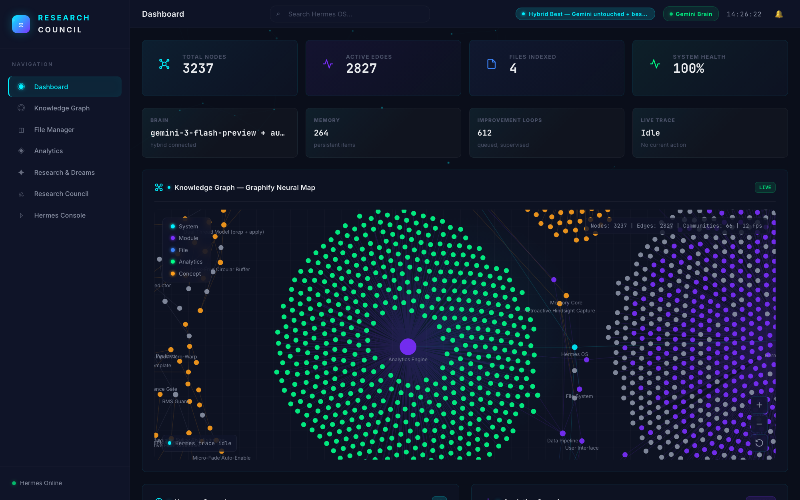

# Hermes OS — Personal Mission Control

A real-time, knowledge-graph-powered personal dashboard driven by **Hermes**, an
operator agent whose brain is **Google Gemini** (via the free Gemini CLI tied to
your Google account). You chat to Hermes and it changes the dashboard live:
adds/updates analytics, edits the knowledge graph, recolors the UI, keeps
memory, and runs self-improvement / "dream" loops.



> The live dashboard: a Canvas-rendered knowledge graph of 3,000+ nodes, real-time
> stat tiles, and the Gemini-powered operator agent ("Hermes") running its
> research and self-improvement loops — all mutating live as you chat.

---

## Quick start

```bash
npm install              # first time only
npm run service:install  # install Hermes as an always-on login service
```

Open **http://localhost:5210**.

### Always-on service (the "never offline" guarantee)
Hermes runs as a macOS LaunchAgent (`com.hermes.os`): it starts when you log
in, and **launchd restarts it automatically whenever it dies** — crash loops,
closed terminals and quit apps can no longer leave the dashboard offline in
the morning. Running councils auto-resume on every backend boot.

```bash
npm run service:logs       # tail the live server log
npm run service:restart    # force a clean restart
npm run service:uninstall  # stop + remove the service (and its guardian)
```

Logs live at `~/Library/Logs/hermes-os.log`. (`npm run dev` still works for
one-off terminal sessions, but the service is the way Hermes is meant to run —
don't run both at once.)

**The guardian (`com.hermes.guardian`).** A second, independent LaunchAgent
installed alongside the service: every 45s it health-checks the backend
(:3210) and UI (:5210); after two consecutive failures it force-restarts
`com.hermes.os` — and if the service plist has gone *missing* entirely, it
reinstalls it. KeepAlive heals crashes; the guardian heals what KeepAlive
can't see (hung processes, stolen ports, an unloaded service). Guardian log:
`~/Library/Logs/hermes-guardian.log`.

**"⟳ Revive agents" button** (Research Council header): the in-app fix for
"the agents look offline". One click re-tests the brain, re-engages any idle
council loops and probes quota-paused ones; if the backend itself is down it
holds the line, polls health while launchd/the guardian restart it, and
reloads when it's back. `POST /api/system/revive`.

> Runtime note: the service, launcher and guardian are pinned to
> **`/opt/homebrew/bin/node`** — the node `better-sqlite3` is compiled
> against. (Letting the installer pin whatever node ran `npm` once produced
> an nvm-v22 plist and an `ERR_DLOPEN_FAILED` crash-loop.)

> Ports: Hermes OS deliberately uses **5210/3210** — your other project
> ("Research Model") owns 5173/3001 and kills whatever sits on those ports.

> Your machine's default `node` is very old (v12 via nvm). You don't need to
> change it — `npm run dev` auto-detects a modern Node (Homebrew v24) and runs
> everything with it. If you ever rebuild native modules, use that same Node:
> `PATH="/opt/homebrew/bin:$PATH" npm rebuild better-sqlite3`.

Hermes works immediately in **local control mode** (it can already add widgets,
edit the graph, recolor the UI, store memory). To unlock real reasoning,
dreaming and self-improvement, connect the Gemini brain — one step:

## Connect the Gemini brain (one time, free)

```bash
npm run connect-brain
```

This pre-selects the free **"Login with Google"** method and opens the Gemini
sign-in in your browser. Sign in with **your own Google account**. When it drops
into the Gemini prompt, type `/quit`. Back in the dashboard console, click
**Test brain** — the status pill should turn into `Brain: gemini-3-flash-preview`
(the newest Flash model; "gemini 3.5 flash" doesn't exist as an id, so friendly
names like that are auto-mapped to it, with automatic fallback to 2.5 models).

No API key, no cost (personal Google accounts get a generous free daily quota).

### Prefer an API key instead?
Put a key from <https://aistudio.google.com/apikey> in your environment
(`export GEMINI_API_KEY=...`) or tell Hermes in chat. The API key path is used
automatically when present (and as a fallback to the CLI).

---

## Talk to Hermes

Open the **Hermes Console** (or use the Analytics "add a metric" box) and try:

- `add a live revenue widget called MRR at 12,400 dollars`
- `track API latency in ms and CPU load`
- `remove the page views widget`
- `make the theme accent purple` (or `#7b2fff`)
- `remember that I ship updates on Fridays`
- `add a knowledge-graph node "Launch Plan" and connect it to Mission Control`
- `research the best vector databases for personal knowledge bases` ← live web research
- `dream up new ideas` / `enable the dream loop`
- `set your dream focus to growing my YouTube channel`

Every change is applied by the backend and streamed to the UI over WebSocket, so
you see it happen in real time. Each Hermes reply shows green **action chips**
for exactly what it changed.

### How it controls the dashboard
Gemini replies with a strict JSON object `{ "reply": ..., "actions": [...] }`.
The backend validates and executes the actions. Supported actions include:
`add_widget`, `update_widget`, `remove_widget`, `remember`, `forget`,
`add_node`, `connect_nodes`, `set_theme`, `set_config`, `queue_task`, `insight`.
See `server/hermes.js` → `_buildSystemPrompt` / `_applyActions`.

### Deep research (Research & Dreams view)
Type a question (or tell Hermes "research X" in chat). The pipeline runs
**plan → gather → synthesize → integrate**: it decomposes the question into
sub-questions, answers each with **live Google web search** through the Gemini
CLI, then writes a cited markdown report. Reports are saved as artifacts,
key facts become memories, and insight nodes are woven into the knowledge
graph. Every phase streams to the UI in real time.

### Research Council (multi-agent hypothesis tournament)
The **Research Council** view runs a coordinator-worker system of specialized
agents over the same Gemini brain — inspired by the published "AI co-scientist"
frameworks, but fully domain-agnostic (you supply the research goal at runtime):

| Role | Job |
|------|-----|
| **Supervisor** | decomposes the goal into focus areas, allocates each round's work |
| **Generation** | proposes new candidate hypotheses (web-grounded by default; debate mode on frontier rounds) |
| **Reflection** | stress-tests each candidate; fatally flawed ones are rejected |
| **Ranking** | Elo tournament — pairwise judge comparisons on novelty + plausibility |
| **Proximity** | clusters similar candidates and retires near-duplicates |
| **Evolution** | refines the leaders into improved successors (with lineage) |
| **Meta-review** | every 4th round, distills tournament-wide lessons all agents learn from |
| **Falsification** | web-grounded reality checks: hunts prior art + disconfirming evidence (with clickable source links) |
| **Deep verification** | decomposes a leader into its load-bearing assumptions and audits each one independently |

Before the first iteration a **criteria agent** derives goal-specific judging
axes (e.g. "app ideas nobody built" → UNMET NEED · FEASIBILITY · MARKET
POTENTIAL); every match, critique and the final verdict judge on those axes,
not generic ones.

**Agent attributes (live tuning).** Every agent has five operator-tunable
attributes (1-10): strictness, creativity, skepticism, thoroughness, risk
appetite — rendered as the colored **halo** around its station in the Council
Chamber. **Right-click any agent → Change attributes** for live sliders plus a
free-text standing directive; changes are re-read on the agent's *very next
brain call* (even mid-iteration) and the agent acknowledges the retune in its
prompt. Left-click an agent to open its **mind**: live thinking state, its
last thought, and the full thought stream. The judging side (reflection,
ranking, interpret) is deliberately strict by default.
REST: `GET /api/council/:id/agents` · `PATCH /api/council/:id/agents/:role`.

**Slop shield.** The reflection agent scores every new hypothesis for
`slopRisk` (1-10: buzzwords, unfalsifiable claims, generic filler, no concrete
mechanism). Anything at or above the strictness-derived ceiling
(`13 − strictness`, so 5 at the default strictness 8) is ejected on sight with
a `🛡` event, and the ranking judge is instructed that polish without substance
must lose. Slop scores surface as badges on the leaderboard and in the graph
popovers.

**Hypothesis graph.** Every node is clickable: a popover shows the statement,
critique, per-criterion scores, slop badge and lineage, with one-click jump to
the leaderboard and a **Trace lineage** mode that dims everything except the
node's ancestry and descendants.

**Evolution Tree.** A living forest of every idea the council ever had: each
founding hypothesis is planted on the ground line (chronologically), evolution
children branch upward generation by generation. Branches **grow in** with an
animated path draw, nodes pop in with an elastic ease, freshly-rejected ideas
**wither and shed falling leaves**, the champion wears a pulsing 👑, and node
glow + size = Elo (color = cluster, dashed ring = evolved). Hover any node to
light its **sap line** (full ancestry + descendants, animated flow); click for
the same detail popover as the graph. The SVG persists across updates, so the
forest visibly *grows* in front of you — never repaints.
`GET /api/council/:id/tree`.

**Intelligence engine (research-grounded).** The council loop implements the
mechanisms the AI-for-discovery literature shows actually matter — AI
co-scientist (Gottweis 2025), FunSearch/AlphaEvolve, POPPER, LLM-judge
debiasing (Wang 2023), self-consistency (Wang 2022):

- **Seeded Elo debuts** — reflection's promise/testability/slop scores seed
  each newcomer's starting Elo (±120 around 1200); evolution children inherit
  their parent's standing minus a small regression. Early matches refine a
  real prior instead of a coin flip.
- **K-factor decay (Glicko-style)** — rookies move fast (K≈48), proven
  veterans stabilize (K→16); one noisy judgment can't topple a 20-match leader.
- **Uncertainty-directed scheduling** — the match budget targets close-Elo,
  low-match, cross-cluster pairs (max information); blowout rematches between
  settled veterans are skipped.
- **High-stakes double-judging** — the most decisive pairing each round is
  judged twice with the cards swapped, debate-style ("advocate A, advocate B,
  cross-examine, ruling"); in hybrid mode by two different model families
  (panel of judges). Disagreement = an honest **draw**, not a position-bias
  coronation. Gated off at Eco power.
- **Reason-before-score judging** — every judge must work through the criteria
  in a `reasoning` field *before* committing numbers (cuts verbosity bias).
- **Semantic dedup + keystone assumptions** — reflection (same single call)
  also flags mechanism-level re-statements of past ideas the lexical gate
  can't see, and names each hypothesis's load-bearing **keystone assumption**,
  which evolution then targets.
- **Meta-review** 📚 — every 4th iteration one call reads all recent match
  rationales + critiques and distills standing lessons ("what keeps winning /
  losing and why"), injected into generation, reflection, evolution and the
  supervisor. The council learns its own taste.
- **Falsification probes** 🔬 — with web search on (the default), every 4th
  iteration the tournament leader faces the live literature: prior art and
  disconfirming evidence are hunted POPPER-style; survival earns a badge, a
  challenge costs Elo and feeds evolution. Citations carry their real source
  URL, rendered as clickable links throughout the UI.
- **Deep verification** 🧪 — on the even rounds falsification skips, the
  strongest not-yet-audited leader is decomposed into its 3-5 load-bearing
  assumptions and each is audited independently (web-grounded when search is
  on). One audit per hypothesis, ever. Broken = elo −70, cracked = −20,
  sound = +20; the repair note becomes evolution's work order.
- **Debate generation** 🗣 — on frontier rounds and whenever the novelty gate
  just caught generation repeating itself, proposals must first survive a
  staged 3-perspective debate (mechanist · empiricist · contrarian) written
  before the hypotheses in the same call; each rationale names the attack it
  survived. Web-grounded calls always ride the Gemini lane, where the search
  tools actually live (the OpenRouter web plugin silently degrades on free
  accounts).
- **Crossover + wildcard evolution** — every 4th round the two most *distant*
  idea families are fused into a hybrid mechanism (island-model migration);
  otherwise a 20% wildcard chance radically mutates a mid-ranked candidate
  instead of politely refining a leader.
- **Hot-but-thin territory** 🔥 — the territory map flags clusters with a
  strong leader but little exploration as premium ground (MAP-Elites-style
  illumination).
- **Self-consistency verdict** — Conclude runs **3 independent deliberations
  in parallel and majority-votes the winner**, so one bad sample can't crown
  the wrong hypothesis.

Type a goal, pick an intensity, hit **Convene**. The loop runs continuously:
every iteration generates → critiques → evolves → ranks → clusters, streaming
live into the **Council Chamber** (the agent ring fires station-by-station in
realtime), the Elo leaderboard, and a per-council **hypothesis graph**
(size = Elo, color = cluster, dashed = evolution lineage).

When a **Gemini usage limit** is hit the brain first falls through the model
ladder (3-flash → 2.5-flash → 2.5-pro each have separate free quota); only when
all are spent does the council pause, probing on a backoff (2 → 5 → 15 → 30 min
heartbeat) until quota returns, then resuming by itself — across backend
restarts too, since everything persists in SQLite (`councils`,
`council_hypotheses`, `council_matches`, `council_events`, `council_evidence`).
A watchdog re-engages any loop that ever goes idle. It runs until you press
**Stop** or **Conclude**.

**Conclude & Verdict:** the verdict agent ends the tournament with a final
report — winner with per-criterion scores, podium + full standings, a synthesis
of how the tournament unfolded, and concrete next steps. Shown as the gold
verdict panel and saved as an artifact in Research & Dreams. A concluded
council can be **Resumed** to keep researching.

**Closed loop:** paste external results into the **Evidence** box. N independent
data-interpretation instances (default 3) analyze it in parallel, a consensus
pass merges them (single-pass errors cancel out), and the consensus feeds the
next iteration's generation/evolution prompts.

REST: `POST /api/council` `{goal, config}` · `GET /api/council/:id` ·
`GET /api/council/:id/graph` · `GET /api/council/:id/tree` ·
`POST /api/council/:id/stop|resume|conclude|evidence`.
Engine: `server/council.js` · prompts: `server/council-prompts.js` ·
state: `server/council-store.js`.

> Quota math: Standard intensity ≈ 10 calls/iteration every ~1 min. A long
> unattended run will spend the daily free quota in a few hours (that is the
> design: run until the limit, hold, auto-resume). Use Relaxed for all-day
> runs, or set `maxIterations` to auto-conclude with a verdict.

### Dream loop / self-improvement (the AGI loop)
Each dream cycle runs **seed → diverge → critique → evolve → act**:
1. **Seed** — gathers context from memory, the graph, past research and your `dreamFocus`.
2. **Diverge** — generates 5 genuinely novel ideas (dream mode).
3. **Critique** — a skeptical judge pass scores each idea on novelty / feasibility / value.
4. **Evolve** — the winning idea is refined into a concrete next step.
5. **Act** — Hermes applies real dashboard actions (insights, graph nodes, widgets, queued loops).
6. **Reflect** (every 4th cycle) — Hermes **rewrites its own standing directives**,
   which are injected into every future prompt: bounded self-improvement.

All ideas land in a scored **idea ledger**; cycles and stages stream live.
Toggle **Auto-dream** in Research & Dreams (10-minute cadence by default — safe
for the free Gemini quota), or say "dream now". In `supervised` autonomy dreams
can only add things; switch to `autonomous` to let Hermes act freely.

---

## Architecture

```
server/
  index.js        Express + WebSocket (:3210), REST API
  hermes.js       Hermes agent: chat, action protocol, memory, telemetry
  cognition.js    Research pipeline + dream loop + self-reflection engine
  brain.js        Gemini access (CLI primary w/ model fallback ladder,
                  REST API fallback, web-search mode, never hangs)
  analytics.js    Analytics engine (+ live widgets)
  graph-engine.js Knowledge-graph builder / community detection
  database.js     SQLite — graph, widgets, memory, tasks, runs, ideas, artifacts
src/
  main.js         App shell, WebSocket routing, live theming
  components/     Dashboard, GraphView (Canvas engine: glow sprites, batched
                  links, quadtree hit-testing, dirty-flag render loop — smooth
                  at any node count, zero cost at rest; fps meter in the corner),
                  AnalyticsPanel, CognitionPanel, HermesConsole, FileManager
scripts/
  launch.cjs      Version-safe launcher (runs under old node, re-execs modern;
                  restarts dead children forever with backoff — no give-up cap)
  install-service.cjs  Installs the com.hermes.os LaunchAgent (always-on)
  connect-brain.cjs  One-step Gemini login
vendor/hermes-agent  Nous Research hermes-agent (optional reference; NOT in
                  this repo — clone it yourself, see Credits below)
```

Config lives in the `hermes_config` table and is editable from chat
(`set_config`) or `PATCH /api/hermes/config`. Key fields: `model`,
`autonomyMode`, `dreamLoopEnabled`, `accent`, `themeMode`, `geminiApiKey`.

## Troubleshooting

- **Console says "local (needs_login)"** → run `npm run connect-brain`, sign in,
  click **Test brain**.
- **"Gemini brain timed out"** → first call after login can be slow; retry.
- **Port already in use** → `lsof -ti tcp:3210 | xargs kill` (UI: 5210).
- **better-sqlite3 ABI error** → you ran it under a different Node than it was
  built for. Rebuild: `PATH="/opt/homebrew/bin:$PATH" npm rebuild better-sqlite3`.
- **Research/dream stuck** → each stage has hard timeouts and the run is marked
  `failed` with the reason in its log; just start a new one.

## Credits & License

Hermes OS — the dashboard, the real-time server, the knowledge-graph engine, the
Canvas graph renderer, the council/cognition/dream pipelines and the always-on
service layer — is original work by **Reinhardt Buhr**, released under the
[MIT License](LICENSE).

The agent's brain is **Google Gemini**, accessed through the Gemini CLI.

This project can optionally reference **[Hermes Agent](https://github.com/nousresearch/hermes-agent)**,
the self-improving agent framework by **[Nous Research](https://nousresearch.com)**
(MIT License, © 2025 Nous Research). To avoid confusion: *Hermes Agent* is Nous
Research's framework; *Hermes* in this project is the in-app operator agent that
drives the dashboard. The Nous repo is **not bundled here** (it's 164 MB with its
own git history). If you want that integration, clone it into `vendor/`:

```bash
git clone https://github.com/nousresearch/hermes-agent vendor/hermes-agent
```

All credit for Hermes Agent belongs to Nous Research.
